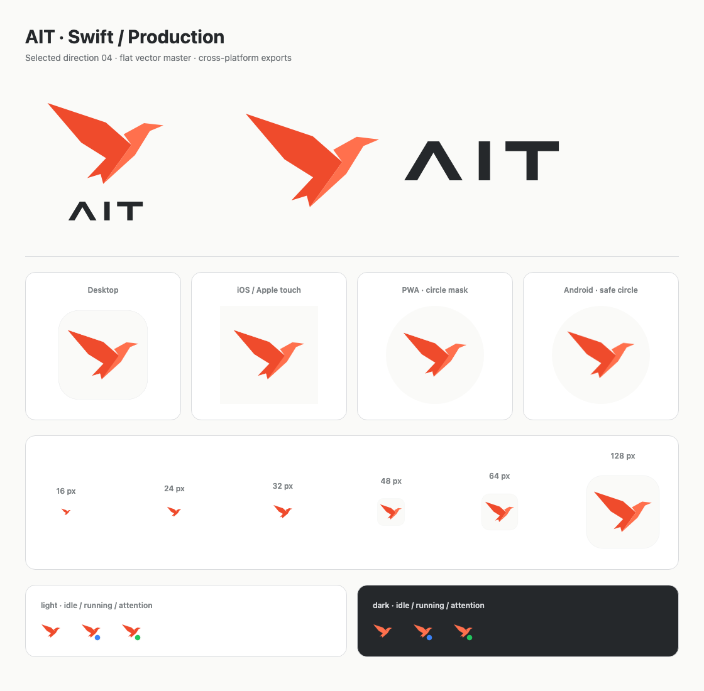

# AIT 飞鸟 Logo 落地报告

日期：2026-09-27。依据 [ADR-051](../../decisions/branding/adr-051-ait-brand-identity.md) 的 04 飞鸟精修稿，
仓库内 AIT 产品 Logo 已替换为共同矢量源生成的橙红飞鸟。

## 实现范围

唯一可编辑源为 [`ait-mark.json`](../../../apps/mobile/src/branding/ait-mark.json)，包括两折面飞鸟、
路径化 AIT 字标、单色轮廓、16–32 px 光学校正轮廓、品牌色和容器位置。
[`AitLogo`](../../../apps/mobile/src/components/icons/ait-logo.tsx) 与
[`generate-brand-assets.mjs`](../../../scripts/generate-brand-assets.mjs) 直接读取相同数据，
不依赖生成图裁切、系统字体或在线服务。

| 位置                                 | 接入结果                                                                                                     |
| ------------------------------------ | ------------------------------------------------------------------------------------------------------------ |
| 根目录、README、旧 `apps/desktop` 壳 | 更新 `logo.svg` / 512 px PNG；旧壳 favicon 改用专用小尺寸轮廓，静态拷贝流程已更新                            |
| `apps/desktop` Electron 壳           | 更新开发与发行 PNG、32/64/128/256/512 px 图标集、Windows ICO、macOS ICNS                                     |
| 桌面打包与缓存                       | 各平台打包加入运行时 `icon.png`，Windows 加入 `icon.ico`；分支图标缓存版本更新为 `v4-swift`                  |
| 应用界面                             | 欢迎页与启动页使用飞鸟 + 路径 AIT 字标；打开项目、启动错误和工具调用图标使用飞鸟                             |
| 启动效果                             | 移除旧 A 字母的 Web 内联遮罩和 Native 闪光渐变，展示静态平面主标；保留错误、日志、重试交互                   |
| Expo / iOS / Android                 | 更新不透明 App 图标、透明自适应前景、白色通知轮廓、浅/深背景启动图；通知色使用品牌橙红，浅色启动背景使用暖白 |
| favicon                              | 深浅两种背景 × 正常、运行、提醒三个状态全部更新；运行蓝点、提醒绿点沿用原语义                                |
| PWA                                  | 更新 Apple touch、192/512 px maskable 安装图标及暖白启动背景                                                 |
| 旧资源                               | 删除无引用的绿色和白色蝴蝶 SVG、旧 `PaseoLogo` 组件；历史设计归档独立保留                                    |

Provider、编辑器等第三方图标保留其自身品牌；包名、协议、应用 ID 和 UI 语义配色保持原有约定。
后续明确的界面改名与版本统一见下节。没有 Rust 或领域边界变化。

## 界面品牌与版本统一（2026-09-27 追加）

- `apps/mobile` 九种语言的欢迎、设置、通知、退出、错误与引导文案统一使用 **Ait**。
  清理旧翻译中与单词连写的品牌名，保留翻译键和协议错误匹配键。
- Web 标题、PWA 安装名、原生 App 显示名、桌面菜单与窗口、发行文件名使用 Ait。
  Windows/macOS/Linux 的可执行文件、Helper 和打包脚本同步，避免改名后路径失配。
- 根 workspace、两个客户端及本地共享包统一为 **0.0.6**，与 Rust workspace 和旧桌面壳一致；
  lockfile 同步。Expo 原生派生元数据为 `version=0.0.6`、iOS `buildNumber=6999`、Android `versionCode=6`。
- 发布、桌面更新及 changelog 来源改为 `necokeine/ait`，新增本项目的 `CHANGELOG.md`。
  GitHub 与问题反馈入口指向 Ait；旧版本号不作为当前产品版本继续展示。
- 桌面启动显式保留原来的用户数据目录、worktree 隔离目录及自定义目录；显示名称变更不会创建一套新的设置和浏览器登录状态。
- `npm run verify:release` 验证 release tag、Rust workspace、10 个本地 package 和 lockfile 的版本一致；
  旧桌面壳的检查命令委托该统一检查。

本次追加只改前端、Electron 和元数据；遵循更新后的 `AGENTS.md`，**没有重新运行 Rust 测试**。
下文 Rust 测试结果来自此前 Logo 接入验证。

追加验证通过：前端相关 **108 项测试通过**，共享协议的插件兼容提示 **44 项测试通过**；
桌面相关 **18 项通过、9 项 Linux 专属测试在 macOS 跳过**，
包含三个旧/隔离/自定义数据目录保留用例，以及更名后的 macOS Helper 启动测试。
两个客户端类型检查、Electron 编译、Expo 导出、修改文件的格式与 lint 检查均通过。
静态解析检查覆盖 17686 个翻译字符串，已无 `Paseo` 显示文案残留。
真实浏览器验证英/中文欢迎页、`v0.0.6`、页面标题 `Ait`、深浅色与窄屏布局，无页面错误。

## 资产与显示检查

- `npm run generate:icons` 生成 38 份生产资源；`npm run check:icons` 重生成后逐字节一致。
- `--sync-native` 已刷新本地现有 iOS 的 AppIcon、1×/2×/3× 启动图及深色变体、启动底色；
  共 47 份资源检查通过。原生生成目录不纳入提交。
- 确认 iOS / Apple touch / PWA 为无 alpha 的不透明正方形；Android 前景和启动图保留 alpha；
  通知图标所有非透明像素为纯白。
- Android 前景在 1024 px 画布上，最远可见顶点距中心 **308.65 px**，小于安全圆半径 **312.89 px**。
- 512 px PWA 图标的最远可见顶点 **199.61 px**，小于 maskable 安全圆半径 **204.80 px**。
  这些平台的前景比例按安全区收缩，桌面圆角容器不烘焙进移动端图标。
- ICO 的 16/24/32/48/64/128/256 px 七个内嵌 PNG 均可解码；ICNS 的 11 个分辨率条目可解码，
  并通过 macOS `iconutil -c iconset` 转换检查。
- 浏览器按实际 16/24/32/48/64/128 px 显示检查完成，单色小尺寸保持主翼、头部和分叉尾部；
  同时检查深浅背景下的正常、运行与提醒图标。

## 实际应用页面

对新导出的 Expo 应用进行 Chromium 实际页面检查，覆盖桌面浅色 1440×900、窄屏浅色 390×844、
桌面深色 1440×900。三种场景均显示新双色飞鸟和路径化 AIT 字标，favicon 随系统主题切换，
无横向溢出、无页面 JavaScript 错误。窄屏截图是 Web 布局验证，不冒充 iOS/Android 原生运行结果。

| 场景           | 截图                                                                                                                                  |
| -------------- | ------------------------------------------------------------------------------------------------------------------------------------- |
| 桌面浅色欢迎页 | [查看](../../assets/brand/ait-day-v1/production/welcome-desktop.png)                                                                  |
| 窄屏浅色欢迎页 | [英文](../../assets/brand/ait-day-v1/production/welcome-mobile.png) / [中文](../../assets/brand/ait-day-v1/production/welcome-zh.png) |
| 桌面深色欢迎页 | [查看](../../assets/brand/ait-day-v1/production/welcome-dark.png)                                                                     |

深色页面仅作当前产品的兼容显示：保留原飞鸟，字标跟随前景色、favicon 使用珊瑚色；
完整夜间 BI 仍属于后续设计范围。

## 工程验证与覆盖范围

| 检查                                                    | 结果                                                              |
| ------------------------------------------------------- | ----------------------------------------------------------------- |
| `cargo fmt --all --check`                               | 通过                                                              |
| `cargo clippy --workspace --all-targets -- -D warnings` | 通过                                                              |
| `cargo test --workspace`                                | **1696 通过，8 忽略，0 失败**，含集成测试和 doc-tests             |
| App `tsgo --noEmit`                                     | 通过                                                              |
| Electron `tsgo --noEmit -p tsconfig.json`               | 通过                                                              |
| `npm run build:desktop-assets`                          | 通过，导出包含新哈希 favicon 与品牌组件的 Expo Web / Electron UI  |
| 旧 `apps/desktop` 的 `npm run build`                    | 通过，TypeScript 与品牌静态文件拷贝完成                           |
| `stamped-icon.test.ts`                                  | **10 通过**，覆盖缓存图标相关的已有几何、参数、字体与来源解析行为 |
| 修改的 JS/TS 文件 Oxlint                                | 通过，0 warning / 0 error                                         |
| 资产重生成、图像规格、容器解码、遮罩及页面验证          | 通过，见上文                                                      |

本次不新增与路径数据逐项镜像的单元测试。覆盖方式为现有工程回归、确定性产物检查、
实际像素/容器验证和浏览器页面检查；未新增代码覆盖率百分比统计。

## 使用与限制

日后修改共同矢量源后，运行根目录 `npm run generate:icons` 并提交全部生成资源；
`npm run check:icons` 检查缺失或过期资产。详细使用说明见 [生产资产说明](../../../assets/brand/README.md)。

本次完成代码、生产资源、本地 Web 导出及已有 iOS 资源同步，未重新打包和安装各平台二进制。
已安装应用的系统图标需要重新构建、安装并启动后检查；本报告不声称已完成系统 Dock、任务栏、
设备启动屏或通知栏的安装验收。历史发布包和设计决策截图不被覆盖。
